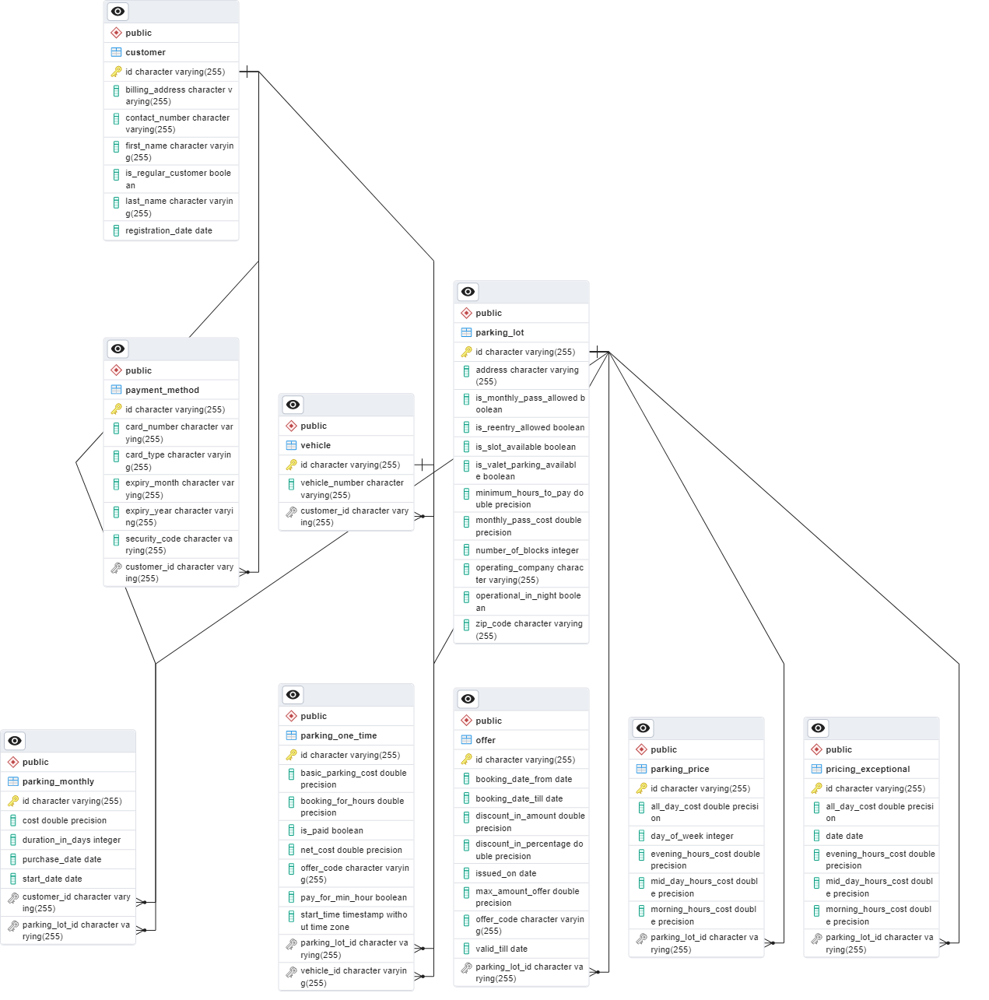

# Parking App

## Description

This is a simple parking app.

## Getting Started

### Prerequisites

* Java 17
* Maven
* Postgres

### Installing

* Clone the repository
* Open the project in your favorite IDE
* Run `mvn clean install` to build the project
* Create a database named `ParkingApp` in Postgres

## Entity Classes

### Offers

- offers_id Integer
- parking_lot_id Integer (Many to One)
- issued_on Date
- valid_till Date
- booking_date_from Date
- booking_date_till Date
- discount_in_percentage Integer
- max_amount_offer Integer
- discount_in_amount Integer
- offer_code String

### ParkingLot

- parking_lot_id Integer
- number_of_blocks Integer
- is_slot_available Boolean
- address String
- zip_code String
- is_reentry_allowed Boolean
- operating_company String
- is_valet_parking_avail Boolean
- operational_in_night Boolean
- minimum_hr_to_pay Integer
- is_monthly_pass_allow Boolean
- monthly_pass_cost Integer
- List<Offer> offers (One to Many)
- List<ParkingPricing> parkingPricing (One to Many)
- List<PricingException> pricingException (One to Many)
- List<ParkingMontlyPass> parkingMonthlyPass (One to Many)
- List<ParkingOneTimePass> parkingOne

### ParkingPricing

- parking_pricing_id Integer
- parking_lot_id Integer (Many to One)
- day_of_week Integer
- morning_hr_cost Integer
- midday_hr_cost Integer
- evening_hr_cost Integer
- all_day_cost Integer

### PricingException

- pricing_exception_id Integer
- parking_lot_id Integer (Many to One)
- date Date
- morning_hr_cost Integer
- midday_hr_cost Integer
- evening_hr_cost Integer
- all_day_cost Integer

### Customer

- customer_id Integer
- registration_date Date
- is_regular_customer Boolean
- contact_number String
- first_name String
- last_name String
- billing_address String
- List<PaymentMethod> paymentMethods (One to Many)
- List<Vehicle> vehicles (One to Many)

### PaymentMethod

- payment_method_id Integer
- customer_id Integer (Many to One)
- card_type Enum
- card_number String(16)
- expiry_month Integer(2)
- expiry_year Integer(4)
- security_code Integer(3)

### Vehicle

- vehicle_id Integer
- customer_id Integer (Many to One)
- vehicle_number String
- List<ParkingOneTimePass> parkingOneTimePass (One to Many)

### ParkingMonthlyPass

- parking_monthly_pass_id Integer
- customer_id Integer (Many to One)
- parking_lot_id Integer (Many to One)
- purchase_date Date
- start_date Date
- duration_in_days Integer
- cost Integer

### ParkingOneTimePass

- parking_one_time_pass_id Integer
- vehicle_id Integer (Many to One)
- parking_lot_id Integer (Many to One)
- start_timestamp Date
- pay_for_min_hr Boolean
- booking_for_hr Integer
- basic_parking_cost Integer
- offer_code String
- net_cost Integer
- is_paid Boolean    